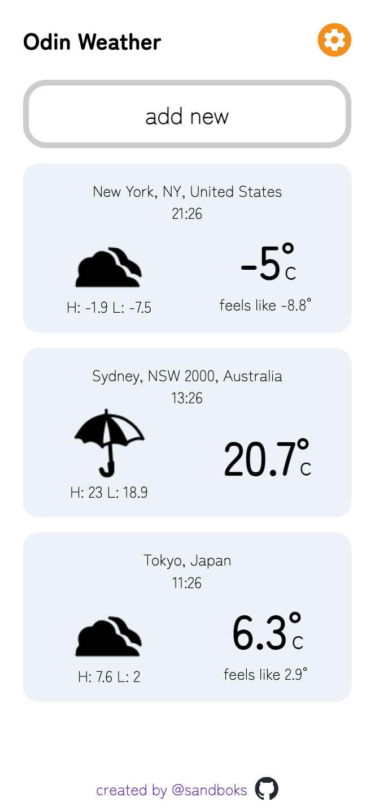

# ACCESS HERE:
https://sandboks.github.io/Odin-Weather/

# PREVIEW

# FEATURES
- Track the weather of your favorite places around the world
- Get detailed information, including how today's weather compares to yesterday
- Freely switch between time formats and units
- User settings are automatically saved as you use the app
- Responsive layout that responsively adjusts to the size of your browser

Tested with Google Chrome and Safari on iOS.

# CREDITS

Weather icons from:

https://www.deviantart.com/elysianaura/art/Persona-5-Weather-Icons-721753501